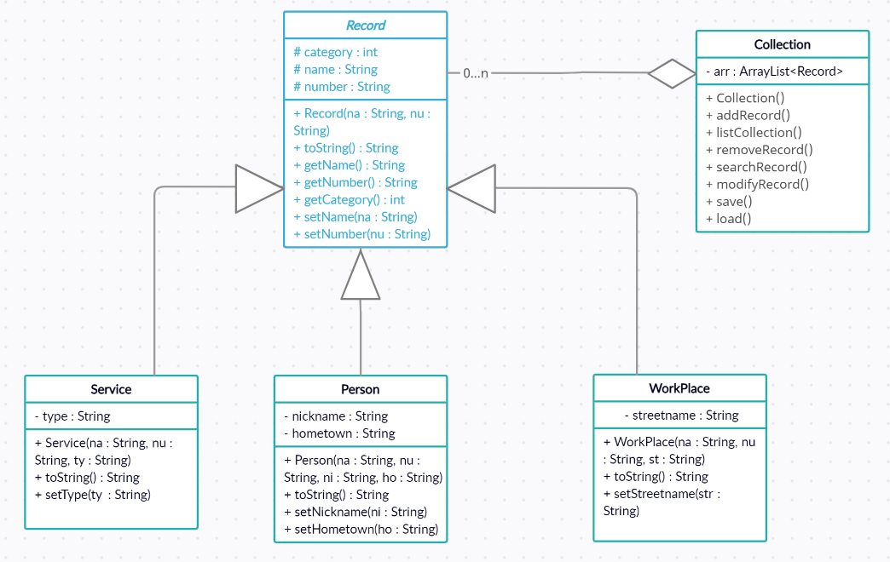

# Java-Phone-Directory
 Java console application for learning/practicing procedural and object orientated programming.

I learned about Eclipse IDE, classes/objects and their relation, polymorphism, inheritance, modularity, encapsulation, unit testing with JUnit 4, exception handling, and I/O streams through this project.

UML Diagram:

